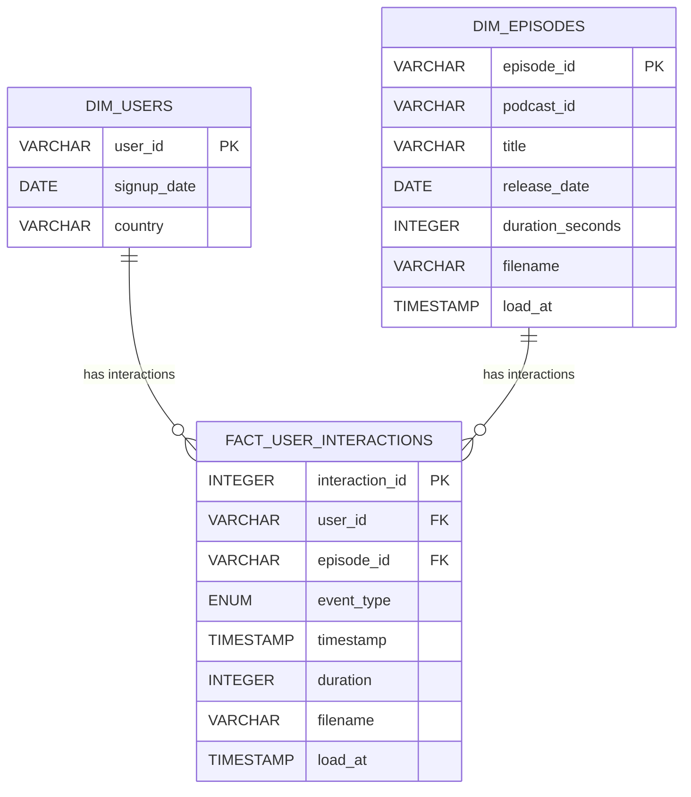

# Solution Design

This solution design composes the [ELT](https://wikipedia.org/wiki/Extract,_load,_transform) and [Medallion Architecture](https://www.databricks.com/glossary/medallion-architecture) patterns, with DBT used for data loading, data models and data transformations. The target database for local development is DuckDB, as it supports both CSV and JSON data formats natively, and is also supported by DBT. The target database for production will be Snowflake, using my personal trial account.

## Part 1: Data Modelling

Given an ELT approach, there will be various models in DBT: 

1. Raw models to hold loaded data from all three sources
2. Validated models to hold the results of running checks based on the "data quality validation" in part 2 of the requirements
3. Cleansed models to hold the results of the "clean and normalise the events" in part 2 of the requirements, and to hold reference data for users and episodes.
5. Analytics models to support the SQL analysis questions in part 3 of the requirements.

### Bronze: Raw Models
The bronze layer will include one model for the raw event data.

#### DBT Configuration
- Materialized: incremental (to process only "new" data since last run, determined by filename column)
- Incremental strategy: append

#### DBT Schema

- **raw_events**
  - event_type (VARCHAR)
  - user_id (VARCHAR)
  - episode_id (VARCHAR)
  - timestamp (VARCHAR)
  - duration (VARCHAR)
  - filename (VARCHAR, not nullable)
  - load_at (TIMESTAMP, not nullable)

With all columns nullable; we assume the event data may have missing values. Since the JSON schema for events is not nested, we can use the duckdb features to directly load the JSON event data into a flat table.

#### DBT Tests (Data Tests)
- Row count matches source file(s) row count

### Bronze: Validated Models
The bronze layer will include one model to hold both valid and invalid events for further investigation. The determination of valid vs invalid records will be based on the "data quality validation" requirements.

#### DBT Configuration
- Materialized: incremental (to process only "new" data since last run, determined by load_at column)
- Incremental strategy: append

#### DBT Schema

- **validated_events**
As per raw_events, plus:
  - validation_errors (VARCHAR[], not nullable) -- list of validation errors or empty list if none

#### DBT Tests (Data Tests)
- Row count matches raw_events row count
- Validation_errors is not null for all rows

### Silver: Cleansed Models
The silver layer will include one model to hold the result of cleaning and normalising "new" and valid event data.

#### DBT Configuration
- Materialized: incremental (to process only valid data, determined by validation_errors column)
- Incremental strategy: append

#### DBT Schema
- **cleansed_events**
  - event_type (ENUM: play, pause, seek, complete)
  - user_id (VARCHAR, not null)
  - episode_id (VARCHAR, not null)
  - timestamp (TIMESTAMP, not null)
  - duration (INTEGER, nullable for non-play/complete events)
  - filename (VARCHAR, not nullable)
  - load_at (TIMESTAMP, not nullable)

#### DBT Tests (Data Tests)
- Not null check on all columns
- Accepted values check on event_type
- Duration not negative
- Unique check on user_id, episode_id, event_type, timestamp
- Row count matches validated_events row count where validation_errors is empty

### Silver: Reference Models
The silver layer will include two models to hold reference data for users and episodes. We assume it has been exported from normalised tables in an RDBMS, and therefore is already valid and clean (integrity-checked and complete).

#### DBT Configuration
- Seeds: users
- Materialized: incremental (episodes only)
- Incremental strategy: merge (episodes only)

#### DBT Schema

- **cleansed_users**
  - user_id (VARCHAR)
  - signup_date (DATE)
  - country (VARCHAR)

- **cleansed_episodes**
  - episode_id (VARCHAR)
  - podcast_id (VARCHAR)
  - title (VARCHAR)
  - release_date (DATE)
  - duration_seconds (INTEGER)
  - filename (VARCHAR)
  - load_at (TIMESTAMP)

With all columns not nullable and column types matching what is defined for the "analytics" model.

#### DBT Tests (Data Tests)
- Row counts match seed file(s) row count

### Gold: Analytics Model
To support the analysis questions in part 3 of the requirements, the analytics model will use a star schema:

- Allows for efficient querying and aggregation, which is ideal for analytics.
- Fact table captures all user interactions, while the dimension tables provide context for users and episodes.
- Indexes on foreign keys and frequently queried fields (e.g., event_type, timestamp) will improve query performance.

The fact table primary key uniquely identifies a single fact row, also known as the "grain". In this model I assumed the grain is `(user_id, episode_id, event_type, timestamp)`. Although not strictly necessary, I decided to add a deterministic surrogate key `interaction_id` as the hash of those grain columns for traceability reasons (logging and auditing for example).

#### DBT Configuration
- Materialized: table (for users), incremental (for events and episodes, to process only "new" data since last run, determined by load_at column)
- Incremental strategy: append (for events), merge (for episodes)

#### DBT Schema

- **fact_user_interactions**
  - interaction_id (INTEGER, PK)
  - user_id (FK to dim_users)
  - episode_id (FK to dim_episodes)
  - event_type (ENUM: play, pause, seek, complete)
  - timestamp (TIMESTAMP)
  - duration (INTEGER, nullable for non-play/complete events)
  - filename (VARCHAR)
  - load_at (TIMESTAMP)
- **dim_users**
  - user_id (VARCHAR, PK)
  - signup_date (DATE)
  - country (VARCHAR)
- **dim_episodes**
  - episode_id (VARCHAR, PK)
  - podcast_id (VARCHAR)
  - title (VARCHAR)
  - release_date (DATE)
  - duration_seconds (INTEGER)
  - filename (VARCHAR)
  - load_at (TIMESTAMP)

#### DBT Tests (Data Tests)
- Fact row count matches cleansed_events row count
- Referential integrity to users and episodes

#### ER Diagram


### Gold: Analytics Model (Analysis Questions)
To hold the sql queries for the analysis questions in part 3 of the requirements.

#### DBT Configuration
- Materialized: view

#### DBT Schema
The schema for each question is defined by the question itself.

#### DBT Tests (Data Tests)
- For the first question, all completion counts are positive

## Part 2: Data Pipeline
The pipeline for the DuckDB target would be implemented as the following steps. For each step, integration tests must be created to ensure the step works as expected.

### 1. Extract and Load

#### Description
- Full load of users data from CSV files into a cleansed model, using DBT seeds. Acceptable since this is reference data and assumed to be relatively small and updated rarely.
- Incremental load of any "new" event data from JSON files into a raw model, using an external source with an append strategy. Justified since the data assumed to be relatively large and updated frequently.
- Incremental load of any "new" episode data from CSV files directly into a cleansed model, using an external source. Although this is reference data and assumed to be relatively small and updated rarely, an incremental model is used here to demonstrate the merge strategy.

Note 1. We assume that any "new" event data would typically be provided as new files, for example:

```
data/
  event_logs_01.json
  event_logs_02.json
  event_logs_03.json
```

```
data/
  episodes_01.csv
  episodes_02.csv
  episodes_03.csv
```

Note 2. We assume that event data files are in NDJSON format, with each line representing a separate JSON object. Further, we expect each JSON object to have the same schema as the raw model. Any missing fields must fail the load step completely. Any extra fields (by name, not position - we are parsing JSON!) will be ignored.

Note 3. We assume that episode data files may contain duplicates of data already loaded. For example, updates to episodes where the title was changed. Therefore, the "transform: cleanse and normalise" step for episodes will include a de-duplication rule to ensure that the cleansed model has no duplicates.

#### Integration Tests (BDD Style)

- For all generated events serialised to an NDJSON file and copied to the staging directory
  - When the file is copied to the loading directory and the raw dbt model is run with all files globbed
  - Assert the count of loaded events
  - Assert one load_at value
  - Assert one filename value

- For all generated events serialised to an NDJSON file and copied to the staging directory
  - When the file is copied to the loading directory and the raw dbt model is run with all files globbed, twice
  - Assert the count of loaded events
  - Assert one load_at value
  - Assert that load_at after the second run is the same as load_at after the first run
  - Assert one loaded filename

- For all generated events serialised to two separate NDJSON files and copied to the staging directory
  - When the first file is copied to the loading directory and the raw dbt model is run once with all files globbed, then the second file is copied to the loading directory and the raw dbt model run again
  - Assert the count of loaded events equals the sum of event counts
  - Assert two load_at values
  - Assert two filename values

### 2. Transform: Validation

#### Description
Validate any "new" event data in the raw model by applying checks according to the "data quality validation" requirements, updating the validated model with validated events.

More specifically, the data quality checks are:
- Columns needing not-null checks: user_id, episode_id and timestamp
- Columns needing "string not empty or blank" checks: user_id and episode_id
- Columns needing "value in set" checks: event_type must be one of play, pause, seek or complete
- Columns needing "timestamp" checks: timestamp must be a valid timestamp in ISO 8601 format with seconds precision
- Columns needing "timestamp range" checks: timestamp must be within a reasonable range (e.g. not in the future, not before 2000-01-01)
- Columns needing "time duration" checks: duration must be a positive integer for play and complete events, and null for other event types

Note 1: the data quality checks in step 2 must be compatible with the cleansing rules in step 3, i.e. any record that passes validation must be able to be cleansed without any errors.

Note 2: if any data quality checks are modified, then validation_errors must be re-calculated for all records in the raw model, not just "new" records. This can be done by running the DBT model in full-refresh mode.

#### Integration Tests (BDD Style)

- For all generated valid events serialised to an NDJSON file and copied to the loading directory and the raw dbt model already run
  - When the validated dbt model is run
  - Assert that all validated dbt tests pass
  - Assert that validation_errors is empty for all rows

- For all generated invalid events serialised to an NDJSON file and copied to the loading directory and the raw dbt model already run
  - When the validated dbt model is run
  - Assert that all validated dbt tests pass
  - Assert that validation_errors is non-empty for all rows
  - Assert that validation_errors contains the expected error messages for each row

### 3. Transform: Cleanse and Normalise

#### Description
Take any "new" and valid event data from the validated model and transform it to a cleansed model according to the "clean and normalise the events" requirements.

More specifically, the cleansing and normalisation rules are:
- Convert event_type to ENUM
- Convert timestamp to TIMESTAMP type
- Convert duration to INTEGER type, setting to null for non-play/complete events
- Enforce not-null constraints on user_id, episode_id, event_type and timestamp

Note 1: "new" data from episode CSV files is directly transformed into a cleansed model on load, see point [1. extract and load](#1-extract-and-load)

#### Integration Tests (BDD Style)
TODO

### 4. Transform: Analytics

#### Description
Take all user data and any "new" event or episode data from the cleansed models and transform it to the analytics model.

#### Integration Tests (BDD Style)
TODO

### Data Pipeline Step Co-ordination and Scheduling
TODO

## Part 3: Analysis
The SQL queries to answer the analysis questions in part 3 of the requirements would be implemented in the analytics model with materialized: view.

## Part 4: Data Retention
This is not specified in the requirements, but a typical approach would be to implement a rolling window retention policy, e.g. keep the last 6 months of event data in the cleansed and analytics models, and archive older data to cheaper storage if needed.